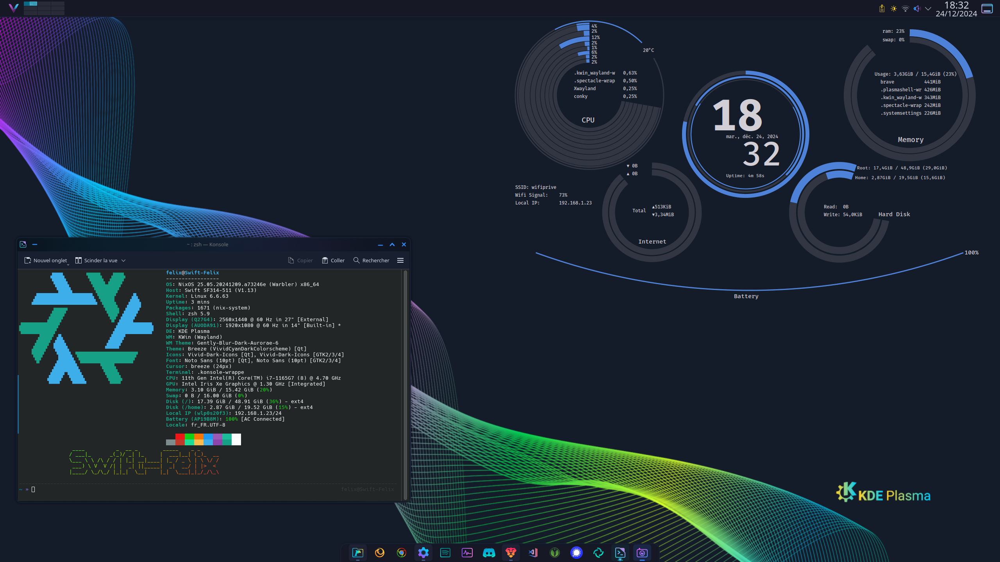

<a href="https://nixos.org" target="_blank" rel="noreferrer"> 
</a>
<p>
  <a href="https://github.com/FelixLusseau/NixFlakes/">
    
  </a>
  <a href="https://nixos.org">
    
  </a>
  <a href="https://github.com/FelixLusseau/NixFlakes/blob/main/LICENSE">
    
  </a>
</p>

[](https://github.com/FelixLusseau)

# NixOS Flakes

## My NixOS modules used for my personal setups !

> <picture>
>   <source media="(prefers-color-scheme: light)" srcset="https://raw.githubusercontent.com/Mqxx/GitHub-Markdown/main/blockquotes/badge/light-theme/note.svg">
>   
> </picture><br>
>
> This is a module repository. You have to import it into your main Flake like in the example below to use it.

```nix
{
  description = "FL's NixOS";

  inputs = {
    nixpkgs.url = "github:nixos/nixpkgs?ref=nixos-unstable";
    flModules.url = "github:FelixLusseau/NixFlakes"; 
  };

  outputs = { self, flModules }@inputs:
    let
    in {
      nixosConfigurations = {
        flnix = flModules.nixpkgs.lib.nixosSystem {
          system = "x86_64-linux";

          modules = [
            flModules.nixosModules.modules
            ./hosts/flnix.nix
          ];
          specialArgs = { inherit inputs; };
        };
      };
    };
}
```

This is my configuration for the GUI, Shell and System.  
A lot of things can be enabled or disabled with the NixOS Options defined in the `modules/default.nix` file following this architecture :
```
options.flcraft
  \_users 
  \_shell
    \_zsh
  \_system
    \_docker.enable
    \_virt.enable
    \_kube.enable
    \_ssh.enable
    \_network-tools.enable
    \_hardware
  \_gui
    \_enable
    \_pkgs
      \_messages.enable
      \_programming.enable
      \_art.enable
      \_gaming.enable
```
You have to fill the options into your `configuration.nix` equivalent file, dedicated for the current installation.

## Gallery



## Credits

Many thanks to [Shinsaber](https://github.com/Shinsaber/nixos-modules) and [GatienC](https://github.com/gatienc/NixFlakes) for the inspiration and guidance.
